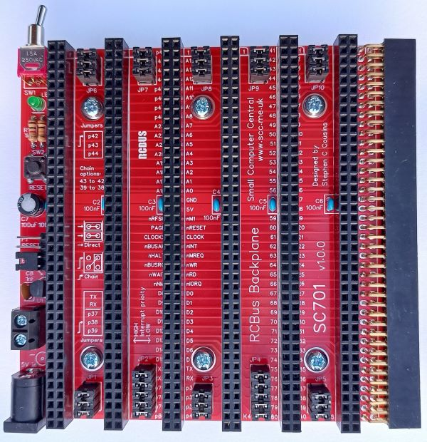

# Single Board Computer for 6502 Microprocessors (SBC6502)

## [Overview](README_Overview.md) &nbsp;&nbsp; [SBC6502 Hardware](README_SBC6502.md) &nbsp;&nbsp; [Virtual Memory Kernel (VMK)](README_VMK.md)

## [Bus/Backplane](README_SBC6502_Backplane.md) &nbsp;&nbsp; [Processor/Memory Managment Unit (MMU)](README_SBC6502_MemoryManagmentUnit.md) &nbsp;&nbsp; [Memory (ROM/RAM)](README_SBC6502_Memory.md) &nbsp;&nbsp; [I/O](README_SBC6502_IO.md)

<!--- MARKUP.INSERT.TEXT.START: ID=SBC6502.Header -->
***A lifelong learning experience ...***

---
<!--- MARKUP.INSERT.TEXT.STOP: ID=SBC6502.Header -->

Because of the projected number of ICs needed and the difficulty of developing a single monolithic PCB, an organization of modular logic cards plugged into a backplane was chosen. Modularity allows the development and debugging of sub-functions, like memory or clock circuitry without having to re-produce a monolithic PCB.

The RCBus standard developed by [Small Computer Central](https://smallcomputercentral.com/) for homebrew 8-bit retro computing provides a turnkey backplane that will work for this project.  They offer 6 slot backplane kit [SC701 Backplane Kit for RCBus](https://www.tindie.com/products/tindiescx/sc701-backplane-kit-for-rcbus-80pin/).  The RCBus specification was developed for Z80 based microprocessors. It is basically an 80-line bus, some lines will be repurposed for a 6502 based project.  Some lines will not be used.  The only short fall of renaming some of the bus lines is that they will be misnamed on the backplane’s silkscreen.

| Pin Name | Pin# | Desc | RCBus Name * |
|---|---|---|---|
| EA0-EA23 | 16-1, 56-49 | The 24-bit Effective Address Bus, addresses memory and I/O registers that exchange data on the Data Bus.  The address lines can be set to the high impedance state by the Bus Enable (BE) signal. | A0-A23 |
| D0-D7 | 28-34 | The eight Data Bus lines D0-D7 are used to provide instructions, data and addresses to the microprocessor and exchange data with memory and I/O registers.  These lines may be set to the high impedance state by the Bus Enable (BE) signal. | D0-D7 |
| *BE* ** | x | The Bus Enable input signal provides external control of the Address, Data and the RWB buffers.  When Bus Enable is high, the Address, Data and RWB buffers are active.  When BE is low, these buffers are set to the high impedance status.  Bus Enable is an asynchronous signal. | x |
| PHI2 | x | Phase 2 In is the system clock input to the microprocessor's internal clock. | x |
| PHI1O | x | Phase 1 Out is the inverted PHI2 signal.  | x |
| PHI2O | x | Phase 2 Out signal is generated from PHI2. | x |
| ~IRQ | 22 | The Interrupt Request (IRQB) input signal is used to request that an interrupt sequence be initiated. The program counter (PC) and Processor Status Register (P) are pushed onto the stack and the IRQB disable (I) flag is set to a “1” disabling further interrupts before jumping to the interrupt handler.  These values are used to return the processor to its original state prior to the IRQB interrupt.  The IRQB low level should be held until the interrupt handler clears the interrupt request source.  When Return from Interrupt (RTI) is executed the (I) flag is restored and a new interrupt can be handled.  If the (I) flag is cleared in an interrupt handler, nested interrupts can occur.  The Wait-for-Interrupt (WAI) instruction may be used to reduce power and synchronize with, as an example timer interrupt requests. | nINT |
| *~ML* ** | x | The Memory Lock (MLB) output may be used to ensure the integrity of Read-Modify-Write instructions in a multiprocessor system.  Memory Lock indicates the need to defer arbitration of the bus cycle when MLB is low.  Memory Lock is low during the last three cycles of ASL, DEC, INC, LSR, ROL, ROR, TRB, and TSB memory referencing instructions. | x |
| ~NMI | x | A negative transition on the Non-Maskable Interrupt (NMIB) input initiates an interrupt sequence after the current instruction is completed.  Since NMIB is an edge-sensitive input, an interrupt will occur if there is a negative transition while servicing a previous interrupt.  Also, after the edge interrupt occurs no further interrupts will occur if NMIB remains low.  The NMIB signal going low causes the Program Counter (PC) and Processor Status Register information to be pushed onto the stack before jumping to the interrupt handler.  These values are used to return the processor to its original state prior to the NMIB interrupt. | x |
| R/~W | 24 | The Read/Write output signal is used to control data transfer. When in the high state, the microprocessor is reading data from memory or I/O.  When in the low state, the Data Bus contains valid data to be written from the microprocessor and stored at the addressed memory or I/O location.  The RWB signal is set to the high impedance state when Bus Enable (BE) is low.  | nWR |
| RDY | x | A low input logic level on the Ready (RDY) will halt the microprocessor in its current state.  Returning RDY to the high state allows the microprocessor to continue operation following the next PHI2 negative transition. This bi-directional signal allows the user to single-cycle the microprocessor on all cycles including write cycles. A negative transition to the low state prior to the falling edge of PHI2 will halt the microprocessor with the output address lines reflecting the current address being fetched.  This assumes the processor setup time is met. This condition will remain through a subsequent PHI2 in which the ready signal is low.  This feature allows microprocessor interfacing with low-speed memory as well as direct memory access (DMA).  The WAI instruction pulls RDY low signaling the WAit-for-Interrupt condition, thus RDY is a bi-directional pin.  On the W65C02 hard core there is a WAIT output signal that can be used in ASIC's thus removing the bi-directional signal and RDY becomes only the input.  In such a situation the WAI instruction will pull WAIT low and must be used external of the core to pull RDY low or the processor will continue as if the WAI never happened.    The microprocessor will be released when RDY is high and a falling edge of PHI2 occurs.  This again assumes the processor control setup time is met.  The RDY pin no longer has an active pull up.  It is suggested that a pull up resistor be used on this pin when not being used.  The RDY pin can still be wire ORed. | x |
| ~RES | x | The Reset (RESB) input is used to initialize the microprocessor and start program execution. The RESB signal must be held low for at least two clock cycles after VDD reaches operating voltage.  Ready (RDY) has no effect while RESB is being held low.  All Registers are initialized by software except the Decimal and Interrupt disable mode select bits of the Processor Status Register (P) are initialized by hardware. When a positive edge is detected, there will be a reset sequence lasting seven clock cycles.  The program counter is loaded with the reset vector from locations FFFC (low byte) and FFFD (high byte).  This is the start location for program control.  RESB should be held high after reset for normal operation. | x |
| *~SO* *** | x | A negative transition on the Set Overflow (SOB) pin sets the overflow bit (V) in the status code register.  The signal is sampled on the rising edge of PHI2.  SOB was originally intended for fast input recognition because it can be tested with a branch instruction; however, it is not recommended in new system design and was seldom used in the past. | x |
| SYNC | x | The OpCode fetch cycle of the microprocessor instruction is indicated with SYNC high. The SYNC output is provided to identify those cycles during which the microprocessor is fetching an OpCode. The SYNC line goes high during the clock cycle of an OpCode fetch and stays high for the entire cycle.  If the RDY line is pulled low during the clock cycle in which SYNC went high, the processor will stop in its current state and will remain in the state until the RDY line goes high.  In this manner, the SYNC signal can be used to control RDY to cause single instruction execution. | x |
| ~VP | x | The Vector Pull (VPB) output indicates that a vector location is being addressed during an interrupt sequence.  VPB is low during the last interrupt sequence cycles, during which time the processor reads the interrupt vector.  The VPB signal may be used to select and prioritize interrupts from several sources by modifying the vector addresses. | x |
| +5V | 18, 58 | Power supply +5 volts, recommended tolerance +/-0.25 volts. | +5V |
| GND | 17, 57 | Power supply GND. | GND |

> \* This is not an equivalancy. This is just the designated RCBus line used to carry the 6502 single.

> ** Not present on the MOS 6502, present on W65C02.

> *** "Incorrectly" label in MOS documentation as SO, but actually is an active low signal.

